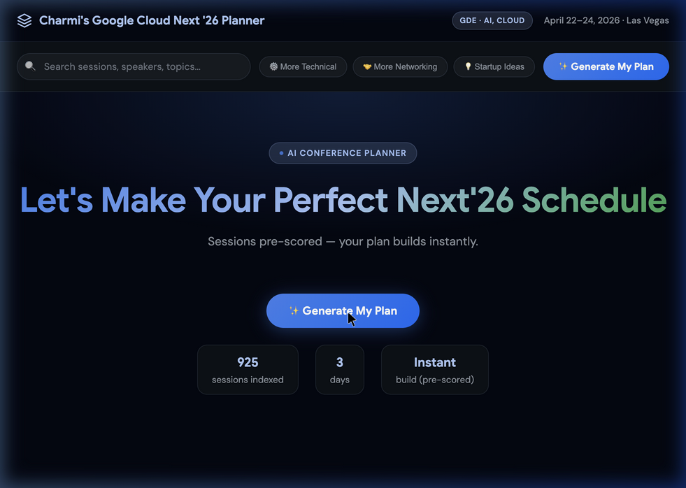
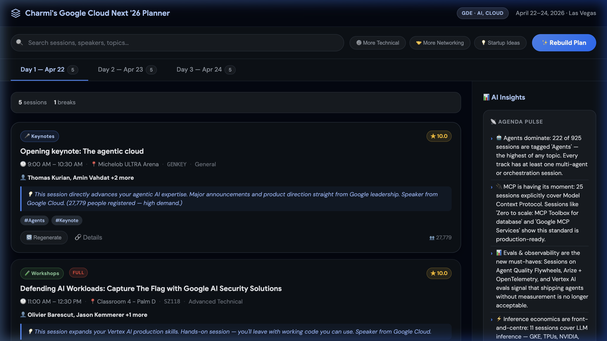
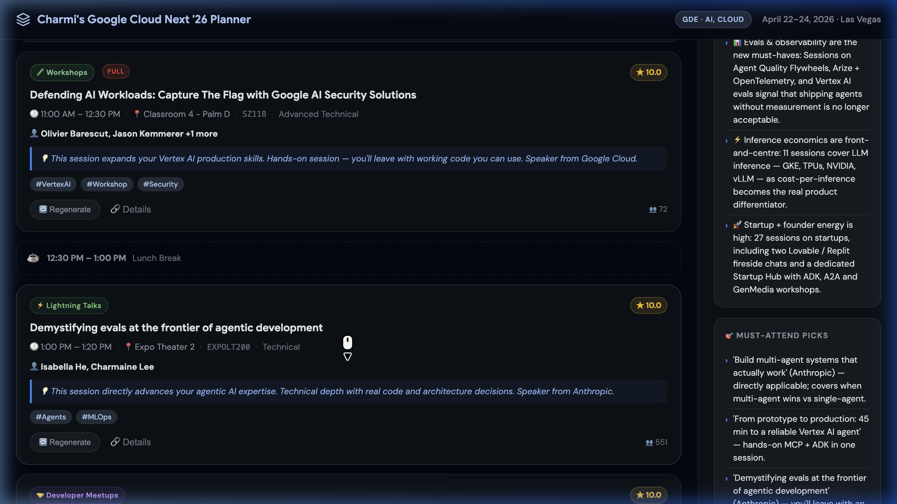

# GCNextSessionPlanner 🗓️

> An AI-powered, personalized conference schedule planner for **Google Cloud Next '26** — built on a 3-layer agentic architecture that combines deterministic Python scoring with optional LLM enrichment.

---

## Screenshots

### Hero — Instant Plan Generation


### Schedule View — 3-Day Personalized Plan with AI Insights


### Session Cards — Scores, Tags, Rationales & More


---

## Features

### 🧠 AI-Powered Session Scoring
- Every session (925 total) is **pre-scored 1–10** using a deterministic heuristic covering session type, technical level, keyword relevance, and social proof (registrant count)
- Optional **Claude AI enrichment** generates personalised *"why should I attend"* rationales for the top-60 sessions
- Scores are inlined into `planner.html` — **no API key required at runtime**

### 📅 3-Day Schedule View
- Sessions automatically organised across **Day 1 (Apr 22), Day 2 (Apr 23), and Day 3 (Apr 24)**
- **Lunch break** and gap detection built in — the schedule respects time conflicts
- Tab-based navigation with session count badge per day

### 🔍 Live Search
- Full-text search across session names, speakers, and topics — **instant results as you type**

### 🎛️ One-Click Schedule Filters
- **More Technical** — re-weights toward Advanced Technical / Technical sessions
- **More Networking** — boosts meetups, birds-of-a-feather, and community sessions
- **Startup Ideas** — surfaces founder, side-income, and entrepreneurship sessions

### ⭐ Session Cards (rich detail)
Each card shows:
- **Relevance score** badge (gold star, 1.0–10.0)
- Session type badge (Keynotes, Workshops, Breakouts, Lightning Talks, etc.)
- **FULL** badge when remaining capacity is zero
- Time + venue + session code + level
- Speaker names (with notable company highlights)
- Personalised **"why attend"** rationale in italic blue text
- **Hashtag labels** auto-derived from content (#Agents, #Gemini, #ADK, #MCP, #RAG, #MLOps, #Startup, etc.)
- **Registrant count** (social proof)
- **Regenerate** button — swaps in the next best session for that time slot
- **Details** link — deep-links to the official Google Cloud Next session page

### 📊 AI Insights Sidebar
- **Agenda Pulse** — live conference trend analysis (e.g. "222 sessions tagged Agents — highest of any topic")
- **Must-Attend Picks** — curated shortlist of highest-signal sessions
- **Side Income Ideas** — 3 post-conference business ideas tailored to the user profile
- **30-Day Project Idea** — a concrete build project to start after the conference

### ♻️ Plan Regeneration
- **Rebuild Plan** button regenerates the entire 3-day schedule with a fresh ranking pass
- Individual session **Regenerate** swaps only that slot — no full reload needed

### 🚀 Zero-Backend, Single-File App
- `planner.html` is a fully self-contained React app with all session data inlined
- Works by opening the file directly in any browser — no server, no API key, no build step

---

## Architecture

This project follows a **3-layer agentic architecture** (see [`AGENTS.md`](./AGENTS.md)):

```
┌─────────────────────────────────────────────────────────┐
│  Layer 1 · Directives  (directives/)                    │
│  SOPs written in Markdown — define goals & workflows    │
├─────────────────────────────────────────────────────────┤
│  Layer 2 · Orchestration  (you / the AI agent)          │
│  Reads directives, routes work, handles errors          │
├─────────────────────────────────────────────────────────┤
│  Layer 3 · Execution  (execution/)                      │
│  Deterministic Python scripts — reliable & testable     │
└─────────────────────────────────────────────────────────┘
```

---

## Project Structure

```
GCNextSessionPlanner/
├── planner.html                  # 🎯 The final deliverable — open in any browser
│
├── execution/
│   ├── score_sessions.py         # ONE-TIME scoring script (deterministic + Claude)
│   └── extract_brand.py          # Firecrawl brand extraction utility
│
├── directives/
│   └── brand_extractor.md        # SOP for running brand extraction
│
├── session_library/
│   ├── sessions_data.json        # Raw scraped session catalog
│   ├── sessions_scored.json      # Pre-scored output (generated by score_sessions.py)
│   └── enrich_sessions_v2.js     # Legacy Node.js enrichment script
│
├── screenshots/                  # App screenshots used in this README
├── brand-guidelines/             # Extracted brand tokens (colors, fonts, etc.)
├── frontend-design/              # UI design references
├── skill-creator/                # Skill packaging and evaluation tools
├── AGENTS.md                     # Agent operating instructions
└── .env                          # API keys (not committed)
```

---

## Pipeline

```
sessions_data.json
       │
       ▼
execution/score_sessions.py   ←  Optional: ANTHROPIC_API_KEY (enrichment)
       │
       ├──▶  session_library/sessions_scored.json   (scored + tagged + why)
       │
       └──▶  planner.html  (rebuilt with SCORED_DATA inlined)
```

---

## Getting Started

### 1. Prerequisites

```bash
pip3 install requests          # only needed for Claude enrichment
```

### 2. Run Session Scoring

**Deterministic only (no API key needed):**
```bash
python3 execution/score_sessions.py --no-enrich
```

**With Claude AI enrichment (top 60 sessions get personalised rationales):**
```bash
# Add your key to .env first:
echo "ANTHROPIC_API_KEY=sk-ant-..." >> .env

python3 execution/score_sessions.py
```

**All flags:**
```
--api-key sk-ant-...   Anthropic API key (overrides .env)
--no-enrich            Skip Claude enrichment (deterministic scores only)
--no-rebuild-html      Don't rewrite planner.html
--enrich-top N         How many top sessions to enrich (default: 60)
--dry-run              Preview output without writing files
```

### 3. Open the Planner

```bash
open planner.html
```

No server needed — it's a fully self-contained single-file app.

---

## Scoring Logic

Each session receives a score (1–10) computed from:

| Signal | Weight |
|--------|--------|
| Session type (Keynote > Workshop > Breakout …) | Up to +3.5 |
| Technical level (Advanced Technical > Technical …) | Up to +2.0 |
| Keyword match against interest profile | Up to +2.0 |
| Topic relevance (Agents, Vertex, Gemini, ADK, MCP …) | +0.4 per topic |
| Registrant count (log-scale social proof) | Up to +2.0 |
| Zero remaining capacity | −0.3 |

**User profile interests** (configurable in `score_sessions.py`):
Agents · ADK · Vertex AI · Gemini · MCP · LLMs · RAG · GenAI · Production deployments · Networking · Startup/Founder

---

## Brand Extraction

To regenerate brand guidelines from any website:

```bash
# Requires FIRECRAWL_API_KEY in .env
python3 execution/extract_brand.py <TARGET_URL>
```

See [`directives/brand_extractor.md`](./directives/brand_extractor.md) for the full SOP. Costs ~6 Firecrawl credits per run.

---

## Key Files

| File | Purpose |
|------|---------|
| `planner.html` | Interactive session planner — open directly in browser |
| `execution/score_sessions.py` | Core scoring + enrichment + HTML rebuild script |
| `execution/extract_brand.py` | Firecrawl-based brand token extractor |
| `session_library/sessions_scored.json` | Pre-computed scored session data |
| `AGENTS.md` | Agent operating instructions (3-layer architecture) |
| `.env` | `ANTHROPIC_API_KEY`, `FIRECRAWL_API_KEY` (gitignored) |

---

## Environment Variables

```bash
# .env
ANTHROPIC_API_KEY=sk-ant-...     # Optional — enables Claude session enrichment
FIRECRAWL_API_KEY=fc-...         # Optional — enables brand extraction
```

---

## License

MIT
